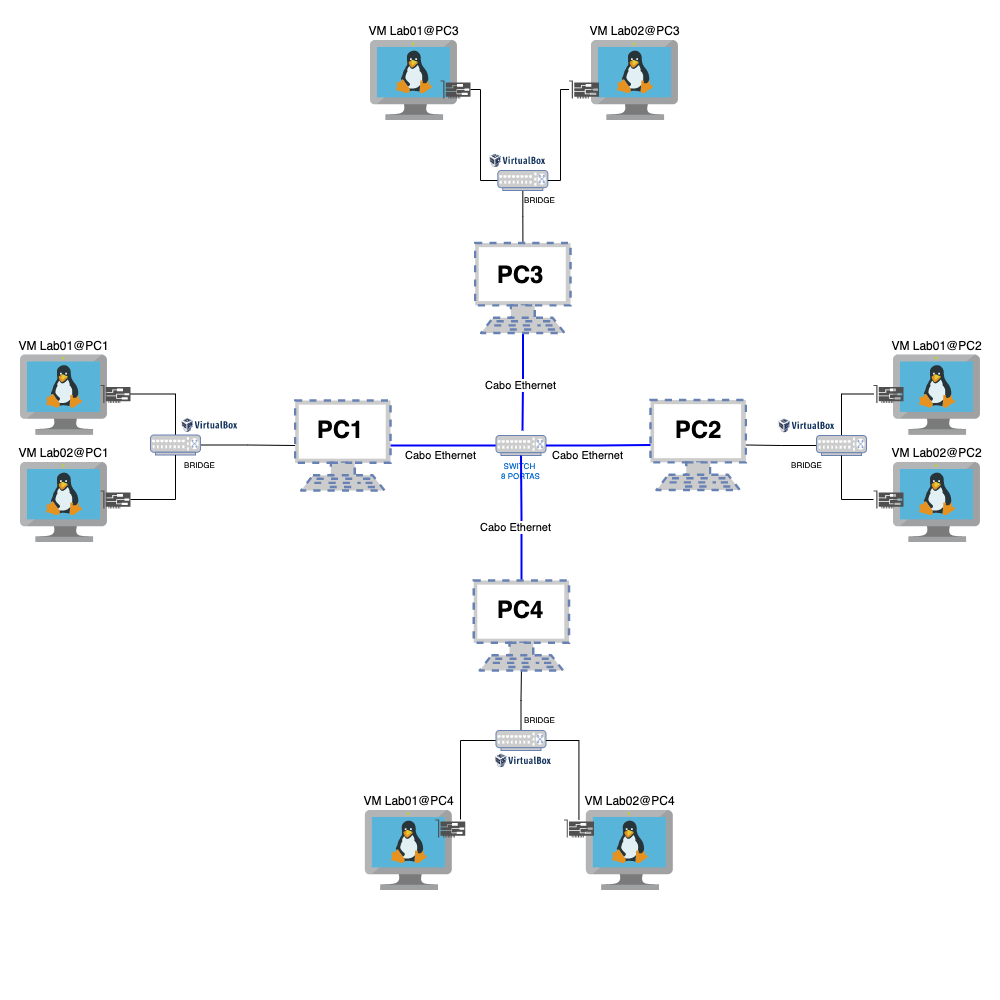

# Projeto Final da Disciplina de Serviço de Redes

   1. Criar um ambiente de rede, no qual deve conter 8 máquinas virtuais com o S.O. Ubuntu Server.
   2. Criar um documento tutorial/roteiro contendo o passo-a-passo de configuração e execução de  um ambiente de rede virtualizada.
   3. Listar a configuração de hardware utilizada em cada MV. (Ex.: quantidade de memória, número processadores/cores, espaço em disco.
   4. Endereçamento IP e nome do grupo será identificado pelo par nome-número do grupo (exemplo Grupo1), lembrando que o primeiro IP é o IP de rede, e o último é o IP de broadcast. [Clique aqui para mais informações!](https://github.com/alaelson/labredes2020/blob/master/projeto-final-sred/subnets_and_names.md)
       - Criar uma tabela com as definições dos IPs das MVs com a máscara de rede /28 (255.255.255.240).
       - A Turma 914 usará a rede 192.168.14.0/24 para criar as subredes de grupos. 
       - A Turma 924 usará a rede 192.168.24.0/24 para criar as subredes de grupos. 
       - A Turma 913 usará a rede 192.168.13.0/24 para criar as subredes de grupos. 
       - A Turma 923 usará a rede 192.168.23.0/24 para criar as subredes de grupos. 
       - Exemplos:
          -- O Grupo 1 da turma 914 usará a faixa 192.168.14.[0-15]/28 
          -- O Grupo 4 da turma 924 usará a faixa 192.168.24.[48-63]/28 
          -- O Grupo 2 da turma 913 usará a faixa 192.168.13.[16-31]/28
          -- O Grupo 6 da turma 923 usará a faixa 192.168.23.[80-95]/28 
          
   5. Criar uma tabela com as definições de nomes para hostname, nomes de domínio (FQDN), apelidos (aliases) e endereços IP das MVs. 
       - O domínio deve obdecer ao formato: ```<grupoX-9yz>.ifalara.net```
       - Exemplo para o hostname das VMs:
            -- frances.grupo2-913.ifalara.net
            -- pajucara.grupo5-914.ifalara.net
            -- vm02-pc3.grupo2-923.ifalara.net

   6. Editar os hostnames no S.O. de cada MV e adicionar o mapeamento IP/Nomes no arquivo /etc/hosts de cada VM.
   7. Em cada vm deve ter o usuário administrador e os usuários com os nomes dos integrantes do grupo. 
   8. Necessário criar novas VMs para o Projeto.
   9. Colocar no tutorial os resultados todos os testes de ping e acesso SSH utilizando os usuários criados nas VMs e os nomes dos hosts.

<p><center> Figura 1:  Topologia de Rede Virtualizada para a execução do projeto.</center></p>   
   
       

  
### Prazos:
#### Etapa 1 - 05/08/2022

a) Apresentar as tabelas de definições de nomes e IPs para todas as VMs
b) Criar a página do github do projeto do grupo.

### Etapa 2 (Final) - 12/08/2022

Entrega/apresentação.
