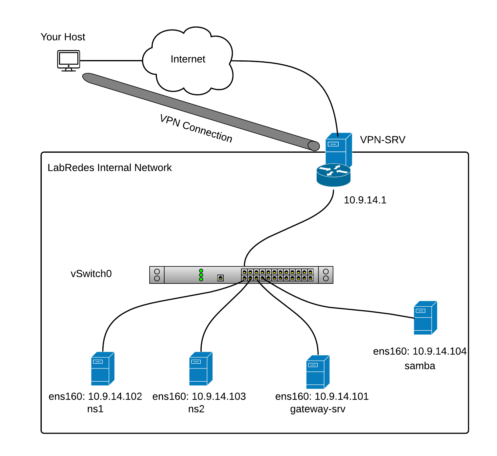
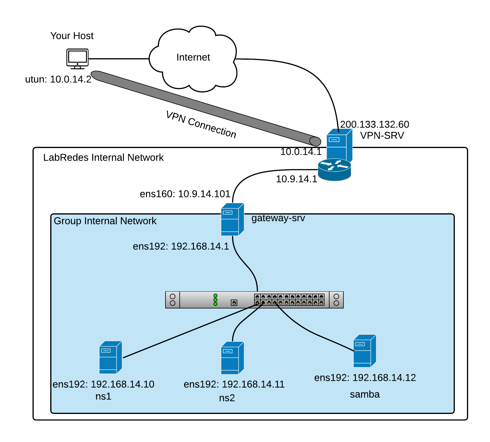

# Projeto Final da Disciplina de Serviço de Redes

   1. Criar um ambiente de rede virtualizado, no qual deve conter 6 máquinas virtuais com o S.O. Ubuntu Server.
   2. Criar um documento tutorial/roteiro contendo o passo-a-passo de configuração e execução de  um ambiente de rede virtualizada.
   3. Listar a configuração de hardware utilizada em cada MV. (Ex.: quantidade de memória, número processadores/cores, espaço em disco.
       -  Iremos utilizar as VMs individuais de cada aluno para compor o grupo de máquinas em rede.
   4. Endereçamento IP e nome do grupo será identificado pelo par nome-número do grupo (exemplo Grupo1), lembrando que o primeiro IP é o IP de rede, e o último é o IP de broadcast. [Clique aqui para mais informações!](https://github.com/alaelson/labredes2022/blob/master/projeto-final-sred/subnets_and_names.md)
       - Criar uma tabela com as definições dos IPs das MVs com a máscara de rede /28 (255.255.255.240).
       - A Turma 914 usará a rede 192.168.14.0/24 para criar as subredes de grupos. 
       - A Turma 924 usará a rede 192.168.24.0/24 para criar as subredes de grupos. 
       - A Turma 913 usará a rede 192.168.13.0/24 para criar as subredes de grupos. 
       - A Turma 923 usará a rede 192.168.23.0/24 para criar as subredes de grupos. 
       - Exemplos:
          * O Grupo 1 da turma 914 usará a faixa 192.168.14.[0-15]/28 
          * O Grupo 4 da turma 924 usará a faixa 192.168.24.[48-63]/28 
          * O Grupo 2 da turma 913 usará a faixa 192.168.13.[16-31]/28
          * O Grupo 6 da turma 923 usará a faixa 192.168.23.[80-95]/28 
          
   5. Criar uma tabela com as definições de nomes para hostname, nomes de domínio (FQDN), apelidos (aliases) e endereços IP das MVs. 
       - O domínio deve obdecer ao formato: ```<grupoX-9yz>.ifalara.net```
       - Exemplo para o hostname das VMs:
            * frances.grupo2-913.ifalara.net
            * pajucara.grupo5-914.ifalara.net
            * vm02-pc3.grupo2-923.ifalara.net       
          
   5. Criar uma tabela com as definições de domínio, com os nomes e endereços IP das MVs. 
       - O domínio deve obdecer ao formato: ```<grupoX>.<turma9yz>.ifalara.local.```
            * frances.grupo2.turma913.ifalara.net
            * pajucara.grupo5.turma914.ifalara.net
            * vm02-pc3.grupo2.turma913.ifalara.net       
 
   6. Editar os hostnames com o nome de domínio no S.O. de cada MV.
   7. Em cada vm deve ter o usuário administrador e os usuários com os nomes dos integrantes do grupo. 
   8. Uma das MVs deve ser o [gateway server](https://github.com/alaelson/labredes2021/blob/master/network/nat/readme.md) do grupo, que deverá ter 2 interfaces rede (WAN e LAN)
   9. Um máquina deve conter o compartilhamento de arquivos com [SAMBA](https://github.com/alaelson/labredes2021/blob/master/network/samba/readme.md).
   10. As outras máquinas virtuais devem ter interface para a rede interna (LAN) configurada com o endereçamento ip de cada grupo.
   11. Duas MVs devem ser os servidores de nomes: nameserver1 (ns1) e nameserver2 (ns2).   
   12. Realizar a [configuração do bind9](https://github.com/alaelson/labredes2021/blob/master/network/bind9/readme.md) com o [nameserver1 (master)](https://github.com/alaelson/labredes2021/blob/master/network/bind9/master.md) e o [nameserver2 (slave)](https://github.com/alaelson/labredes2021/blob/master/network/bind9/slave.md). 
   13. Implementar um servidor Web LAMP com [(Linux + Apache2 + Mysql + PHP)](https://github.com/alaelson/labredes2021/blob/main/network/lamp/readme.md) e adicionar um página para o projeto de redes.
   14. Colocar no tutorial os resultados todos os testes dos exercícios dos roteiros de NAT, DNS (master e slave), do compartilhamento de arquivos com samba e o servidor WEB.

<p><center> Figura 1:  Topologia de Rede Virtualizada antes da execução do projeto.</center></p>   
   
       
<p><center> Figura 2:  Topologia de Rede Virtualizada depois da execução do projeto.</center></p>   
   

  <!-- 14. Grupos da Turma 914 definidos [aqui](https://github.com/alaelson/labredes2021/blob/master/projeto-final-sred/grupos914.md) 
  15. Grupos da Turma 924 definidos [aqui](https://github.com/alaelson/labredes2021/blob/master/projeto-final-sred/grupos924.md) -->

<!-- Etapa 1 - 22/02/2022

a) Apresentar as tabelas de definições de nomes e IPs para todas as VMs

b) Criar o DNS Master e Slave, conforme o nome de domínio ```<grupoX>.<turma9yz>.ifalara.local.```

c) Criar a página do github do projeto do grupo. -->
